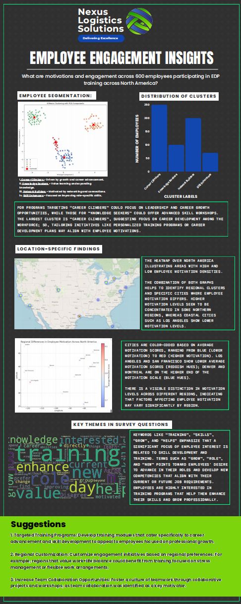

# Optimizing Employee Engagement Through Analytics and Generative AI  

This repository contains a multi-phase analytics project developed for **Nexus Logistics Solutions (NLS)** as part of the **Employee Development Program (EDP) Strategic Initiative**. The project applies advanced data analytics and Generative AI to better understand employee participation, evaluate training effectiveness, uncover motivational drivers, and deliver personalized engagement strategies.  

---

## 📌 Project Overview  

NLS, a global logistics firm, is committed to strengthening its Employee Development Program. This project unfolds across four interconnected cases:  

1. **Case 1 – Utilization Analysis**  
   Examines enrollment trends across courses and office locations, highlighting uneven participation patterns and regional differences in program uptake.  

2. **Case 2 – Training Effectiveness**  
   Evaluates the impact of training on employee skill growth using assessment data, while also comparing virtual versus in-person delivery formats and examining course sequencing effects.  

3. **Case 3 – Employee Motivation & Segmentation**  
   Analyzes survey data from 600+ employees using **Principal Component Analysis (PCA)** and **K-means clustering**. Four motivational segments emerge: *Career Climbers, Knowledge Seekers, Network Builders,* and *Skill Enhancers*. The segmentation also reveals regional differences in motivational drivers.  

4. **Case 4 – Targeted Flyers with Generative AI**  
   Translates analytical insights into practice by creating personalized promotional flyers tailored to each employee segment. A **Custom GPT** model is used to generate draft messaging, supported by an executive reflection on AI’s effectiveness in professional communication.  

---

## 🛠️ Methods & Tools  

- **Data Analysis:** Python (pandas, NumPy, scikit-learn, matplotlib, seaborn)  
- **Machine Learning:** Principal Component Analysis (PCA), K-means clustering  
- **Visualization:** Matplotlib, Seaborn, Folium (heatmaps, choropleth maps)  
- **Generative AI:** OpenAI Custom GPT for flyer generation and content drafting  
- **Deliverables:** Executive summaries, memos, dashboards, infographics, flyers  

---

## 📊 Key Findings  

The analysis revealed several important insights into how employees engage with the Employee Development Program. Utilization patterns showed that enrollment varied significantly across both courses and locations. Certain courses, such as **Logistics Software Essentials** and **Advanced Transportation Management Systems**, consistently attracted higher participation, while others saw less engagement. Location-based analysis highlighted further disparities, with some hubs demonstrating strong uptake and others lagging behind.  

The evaluation of training effectiveness indicated that virtual training formats often performed comparably—or in some cases better—than in-person delivery in terms of accessibility and scalability. Employees who followed structured course sequences tended to show greater skill improvements, emphasizing the role of thoughtful program design.  

The employee survey analysis uncovered four motivational segments through PCA and clustering: Career Climbers, Knowledge Seekers, Network Builders, and Skill Enhancers. Each group reflected distinct drivers of engagement, from career advancement to collaboration and technical mastery, and their distribution varied across regions.  

Finally, Generative AI was tested as a tool for creating personalized promotional flyers. While AI successfully accelerated content creation and captured key motivational themes, it also highlighted the need for human oversight to refine tone and ensure professional alignment. Together, these insights suggest that combining analytics with AI-assisted personalization can help NLS not only understand employee engagement more deeply but also act on it in targeted, scalable ways.  

